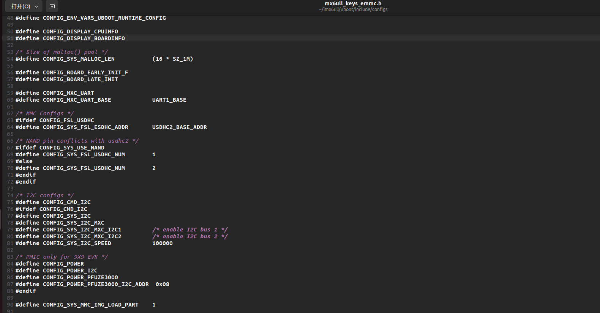

## 从零开始编译u-boot与内核
- 硬件：正点原子阿尔法开发板（Imx6ull-emmc）
- 开发环境：ubuntu22.04
- 交叉编译工具：arm-linux-gnueabihf-
---

## U-Boot

### NXP 官方u-boot编译

#### 1. 安装ncurses库
` sudo apt-get install libncurses5-dev `

#### 2. 获取u-boot
一般来说我们获得u-boot有三种途径分别是：

- u-boot官方源码：uboot是一个遵循着GPL协议的开源软件，原汁原味，但是一般不推荐，因为其支持较少，如果需要，可以在以下链接下载：
[u-boot源码](https://ftp.denx.de/pub/u-boot/)

- 芯片原厂提供：如瑞芯微、NXP、全志等芯片原厂会在u-boot源码基础上增加对自家芯片的支持，我们可以使用厂商提供的u-boot

- 第三方商家：由第三方商家制作开发板或板卡，会在厂商的基础上进一步增加对自己板卡的支持，使用更加方便

由于是以学习为目的，这里使用第二种方式，使用NXP公司提供的u-boot源码进行编译移植

这里通过原子提供的[NXP官方u-boot](https://pan.baidu.com/s/14W3WEpzOr_rNLyWaHOthHw?pwd=69ap )来进行移植和学习

将文件移动到ubuntu下，并解压缩：
` tar -vxjf uboot-imx-rel_imx_4.1.15_2.1.0_ga.tar.bz2 `


#### 3. 编译官方开发板的uboot
在uboot文件夹下的config文件里中，可以找到IMX6ULL EVK开发板对应的配置文件，也就是

设置编译命令：  
`make ARCH=arm CROSS_PILE=arm-linux-gnueabihf- mx6ull_14x14_evk_emmc_defconfig ` 

编译：  
` make V=1 ARCH=arm CROSS_COMPILE=arm-linux-gnueabihf- `

可以看到编译成功：


#### 4. 烧录uboot

1. 从原子资料中获取imx烧写工具imxdownload，并将其放置到文件夹中(我这里把工具类都放到了一个新建文件夹为tools里)

2. 使用工具下载u-boot.bin文件到sd卡中：(这里我的u盘是sdb，要查看自己的，不一定是这个设备)

` ./imxdownload  ../uboot/u-boot.bin /dev/sdb` 
#### 5. 启动设备
1. 插上sd卡
2. 将拨码拨到sd卡启动
3. 打开串口工具，我这里使用的是mobaxterm，可以看到u-boot输出内容


说明了官方开发板的uboot编译成功。

### 移植自己的u-boot

#### 1. 增加自己配置文件

首先，在uboot文件夹下的config里，复制刚刚的mx6ull_14x14_evk_emmc_defconfig,并重命名一下  
` cp mx6ull_14x14_evk_emmc_defconfig mx6ull_keys_emmc_defconfig `

#### 2. 修改自己的配置文件，打开mx6ull_keys_emmc_defconfig
``` 
CONFIG_SYS_EXTRA_OPTIONS="IMX_CONFIG=board/freescale/mx6ull_keys_emmc/imximage.cfg,MX6ULL_EVK_EMMC_REWORK"
CONFIG_ARM=y
CONFIG_ARCH_MX6=y
CONFIG_TARGET_MX6ULL_KEYS_EMMC=y
CONFIG_CMD_GPIO=y

``` 

_主要关注第一行和第四行的修改内容_ 

#### 3. 增加自己板子的头文件

位于uboot文件夹中include中的configs文件夹下，注意还有一个config文件夹，是configs文件夹下

` cd include/configs `

复制mx6ullevk.h文件，并重命名一下，改成自己的头文件  
` cp mx6ullevk.h mx6ull_keys_emmc.h `

打开文件，修改一下宏  

` gedit mx6ull_keys_emmc.h ` 

将如下
```
#ifndef __MX6ULLEVK_CONFIG_H
#define __MX6ULLEVK_CONFIG_H
```
改为
```
#ifndef __MX6ULL_KEYS_EMMC_CONFIG_H__
#define __MX6ULL_KEYS_EMMC_CONFIG_H__
```

这个文件主要是用于配置很多uboot的，所以可以看到里面有大量的#define宏定义，我们可以通过修改这里的配置来修改uboot


#### 4. 添加板级文件夹  

uboot中每个板子都会有一个对应的文件夹来存放板级文件，例如一些外设驱动，NXP的I.MX系列芯片都位于board/freescale文件夹里，可以看到EVK板子是这个文件夹


我们需要复制这个文件夹，用于存放我们自己的文件

` cd board/freescale/ ` 

` cp mx6ullevk/ -r mx6ull_keys_emmc ` 

进入文件夹，重命名mx6ulleck.c文件为mx6ull_keys_emmc.c  
` mv mx6ullevk.c mx6ull_keys_emmc.c `

进入文件夹后，可以看到里面已经有一些编译后的.o文件了，我们需要修改一下编译规则  
` gedit Makefile `  

重点关注obj-y  := xxxxxxx.o
```
# (C) Copyright 2015 Freescale Semiconductor, Inc.
#
# SPDX-License-Identifier:	GPL-2.0+
#

obj-y  := mx6ull_keys_emmc.o

extra-$(CONFIG_USE_PLUGIN) :=  plugin.bin
$(obj)/plugin.bin: $(obj)/plugin.o
	$(OBJCOPY) -O binary --gap-fill 0xff $< $@
```


继续修改imximage.cfg,将第34行改为：
` PLUGIN	board/freescale/mx6ull_keys_emmc/plugin.bin 0x00907000  `  

继续修改Kconfig文件,其实就是把各种mx6ullevk改为自己的，我这里就都是mx6ull_keys_emmc了  

```
if TARGET_MX6ULL_KEYS_EMMC

config SYS_BOARD
	default "mx6ull_keys_emmc"

config SYS_VENDOR
	default "freescale"
	
config SYS_SOC
	default "mx6"

config SYS_CONFIG_NAME
	default "mx6ull_keys_emmc"

endif
```  

继续，修改MAINTAINERS为
``` 
MX6ULL_KEYS_EMMC BOARD
M:	Peng Fan <peng.fan@nxp.com>
S:	Maintained
F:	board/freescale/mx6ull_keys_emmc/
F:	include/configs/mx6ull_keys_emmc.h
```

#### 5. 修改uboot的图形界面配置文件

进入文件夹，/uboot/arch/arm/cpu/armv7/mx6/
` gedit arch/arm/cpu/armv7/mx6 ` 

在207行增加：
```
config TARGET_MX6ULL_KEYS_EMMC
	bool "Support mx6ull_keys_emmc"
	select MX6ULL
	select DM
	select DM_THERMAL
```


并在最后#endif之前增加：  

` source "board/freescale/mx6ull_keys_emmc/Kconfig" ` 


#### 6. 编译u-boot

1. 依次执行：
```
make ARCH=arm CROSS_COMPILE=arm-linux-gnueabihf- distclean
make ARCH=arm CROSS_COMPILE=arm-linux-gnueabihf- mx6ull_keys_emmc_defconfig
make V=1 CROSS_COMPILE=arm-linux-gnueabihf- -j16
```  

#### 7. 修改LCD配置
1. 打开mx6ull_keys_emmc.c文件，里面有一个结构体：
``` 
struct display_info_t const displays[] = {{
	.bus = MX6UL_LCDIF1_BASE_ADDR,
	.addr = 0,
	.pixfmt = 24,
	.detect = NULL,
	.enable	= do_enable_parallel_lcd,
	.mode	= {
		.name			= "TFT43AB",
		.xres           = 480,
		.yres           = 272,
		.pixclock       = 108695,
		.left_margin    = 8,
		.right_margin   = 4,
		.upper_margin   = 2,
		.lower_margin   = 4,
		.hsync_len      = 41,
		.vsync_len      = 10,
		.sync           = 0,
		.vmode          = FB_VMODE_NONINTERLACED
} } };
```  

这里就是LCD的配置信息了，这里我用的原子的7寸屏，也就是像素不一样，所以我的配置结构体改成了：
```
struct display_info_t const displays[] = {{
	.bus = MX6UL_LCDIF1_BASE_ADDR,
	.addr = 0,
	.pixfmt = 24,
	.detect = NULL,
	.enable	= do_enable_parallel_lcd,
	.mode	= {
		.name			= "TFT7016",                //LCD名字，要和环境变量里的panel相等
		.xres           = 1024,                     //X轴像素数量
		.yres           = 600,                      //Y轴像素数量
		.pixclock       = 19531,		            //像素时钟，每个像素时钟周期的长度，单位为皮秒，原子用的时钟是51.2Mhz，就是19531皮秒
		.left_margin    = 140,                      //HBP水平同步后肩
		.right_margin   = 160,                      //HFP水平同步前肩
		.upper_margin   = V=20,                     //VBP垂直同步后见
		.lower_margin   = 12,                       //VFP垂直同步前肩
		.hsync_len      = 20,                       //HSPW行同步脉宽
		.vsync_len      = 3,                        //VSPW垂直同步脉宽
		.sync           = 0,                        
		.vmode          = FB_VMODE_NONINTERLACED    //不使用隔行扫描
} } };
```  

2. 刚刚有一个LCD名字，要与uboot的panel相同，因此，打开mx6ull_keys_emmc.h，找到panel,修改：


3. 重新编译uboot并烧录

看到uboot的输出里，panel信息还是没有更新，是因为uboot会先从emmc里找环境变量，所以，我们手动设置一下：

` setenv panel TFT7016 `  


4. 重启
可以看到点亮了屏幕 显示出了NXP的图标


