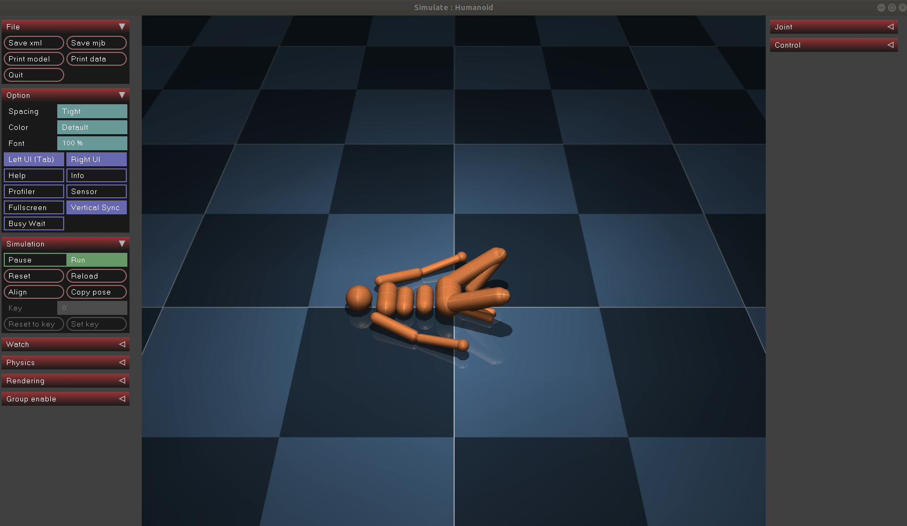

---

## 简介
MuJoCo是一种通用物理引擎，主要用于机器人、生物力学、机器学习等需要快速模拟与环境交互领域的研发。用户使用原生的MJCF场景描述语言定义模型，即使用XML文件格式，也可以加载URDF模型文件。
2021年，DeepMind收购MuJoCo，并在Apache2.0的许可证下直接开源旧版MuJoCo,并带有一个有效期至2031年10月的免费激活文件

## 主要特点
* 广义坐标与现代接触动力学的结合
* 软、凸、解析可逆的接触动力学
* 肌腱几何形状
* 通用驱动模型
* Reconfigurable computation pipeline(不知道怎么翻译合理)
* 模型编译
* 模型数据分离  
MuJoCo在运行时将模拟参数分为两个结构：mjModel、mjData  
* 交互式模拟和可视化
* MuJoCo有自己的建模语言，称为MJCF
* 自动生成复合柔性物体

## 安装
首先需要两个文件  
1. mujoco200
2. 许可文件（mjkey.txt）   

其中mujoco200可以直接在[roboti LLC](https://www.roboti.us/)网页进行下载，许可证文件在[此链接](https://www.roboti.us/license.html)点击下载

准备好后，将许可证文件复制到mujoco200-linux下的bin文件夹即可

## 测试
```
cd mujoco-linux/bin
./simulate ../model/humanoid.xml
```

可以看到一个木偶小人出现了

