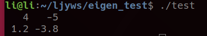

---

## Eigen介绍

Eigen库是C++中的一个开源库，主要用于线性代数的运算，包括有向量运算、矩阵运算等等。由于在机器人控制中应用大量线性代数运算，因此需要掌握eigen库的使用。

## 安装
推荐从源码的方式安装[eigen](http://eigen.tuxfamily.org/index.php?title=Main_Page)库

选择合适的版本下载源码到相应目录并解压得到eigen-x.x.x文件夹
```
cd eigen-x.x.x
mkdir build
cd build 
cmake ..
sudo make install
```


即可完成eigen库的安装

ps: 以上步骤大概率默认将eigen安装在了/usr/local/inculde中的eigen3，然而在很多工程中习惯于调用#include<Eigen/xxx>，而不是#include<eigen3/Eigen/xxx>，因此要将/usr/local/include中的eigen3文件夹复制到上层文件夹即/usr/local/include中，使用：
```
sudo cp -r /usr/local/include/eigen3/Eigen /usr/local/include
```

## 测试
新建一个test.cpp文件并插入代码段
```
#include <iostream>
#include <Eigen/Dense>
using Eigen::MatrixXd;

int main()
{
	MatrixXd m(2,2);
	m(0,0) = 3;
	m(1,0) = 2.5;
	m(0,1) = -1;
	m(1,1) = m(1,0) + m(0,1);
	std::cout << m << std::endl;
}
```

编译
```
g++ test.cpp -o test
```
运行
```
./test
```
得到  
