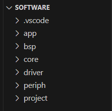
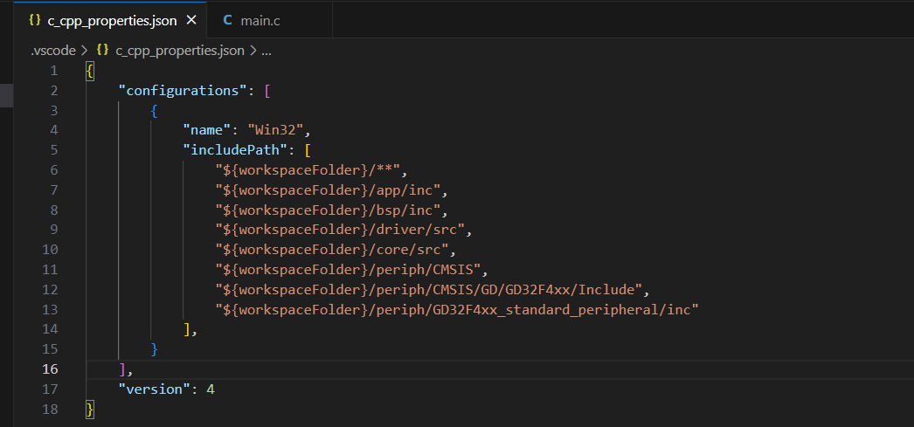
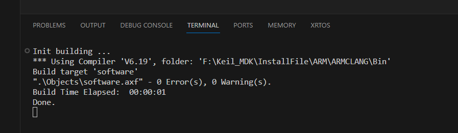
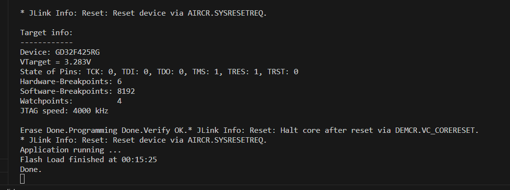
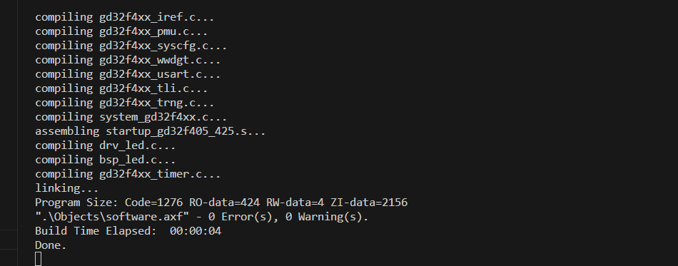

# vscode+keil+build脚本

---
## 简介
&emsp;对于大多开发者，keil软件一定是入门必用的。这常常伴随着开发者甚至到工作依然使用。因此，大家吐槽的点也都大多相同了，如：
- 界面丑陋
- 界面丑陋
- 界面丑陋
...

&emsp;对开发者来说，有时候**优雅**就是效率（哈哈哈）。因此不少开发者包括我自己以及很多朋友，折腾来折腾去，用vscode+gcc也好，用clion也好，用cubeIDE也好，但是在我心里，keil的一些东西是真的很值得使用的，比如实时的一些寄存器观测也好啊等等，所以又折腾过keil+vscode，也就是用keil建立工程，用vscode作为编辑器，再到后来，vscode也出了keil的插件，总的来说，我觉得自己在折腾IDE上浪费了很多时间。而自己又基本在win下开发，很少在linux写MCU的开发，所以，我只能说:keil yyds！。


&emsp;再到后来，又得知另一种方式，我觉得是比较舒服的，所以稍微记录一下。也就是keil工程，vscode作为IDE编辑，并使用build.bat脚本来绑定keil的编译器直接在vscode下编译（说实话，之前总有人吐槽keil的AC编译器，但现在更新到了ac6的编译器，真的很不错了，速度很快）

## 模板
### keil工程
&emsp;首先是需要一个keil的工程，因为最近刚好在用GD32F425这款MCU，所以刚好就直接以我的工程作为模板了。整体的代码结构大致分为：
1. app：主要写用户端应用
2. bsp：板级支持包
3. core：和芯片有关如it.c，时钟配置等等文件
4. driver：驱动层
5. periph：芯片厂商给的外设包
6. priject：keil的工程文件
...（当然还有比如USB、RTOS等等第三方库，这里只是基本最简结构）


&emsp;keil工程建立好后，改为ac6编译器并可以成功编译下载。

### vscode配置
&emsp;vscode的配置就很简单了，主要是得到各种文件的路径，保证在写代码时有自动补全之类的。


&emsp;然后就是build.bat的配置了，这个文件是用来绑定keil的编译器的，在vscode下直接编译

### build.bat
```
@echo off
 
set UV=F:/Keil_MDK/InstallFile/Uv4/Uv4.exe
set UV_PRO_PATH=E:/ljy/ota/ota/software/project/software.uvprojx 
 
echo .>build_log.txt
 
if "%UV_PRO_PATH%" == "" goto NOP
if "%1" == "-b" (
:: build
    echo Init building ... 
    %UV% -j0 -sg -b %UV_PRO_PATH% -o %cd%\build_log.txt 
    type build_log.txt
) else if "%1" == "-f" (
:: flash
    echo Init flashing ...  
    %UV% -j0 -sg -f %UV_PRO_PATH% -o %cd%\build_log.txt 
    type build_log.txt
) else if "%1" == "-r" (
:: build all
    echo Init building ...
    %UV% -j0 -sg -r %UV_PRO_PATH% -o %cd%\build_log.txt 
    type build_log.txt
) else (
:: only build
    echo Init building ... 
	%UV% -j0 -sg -b %UV_PRO_PATH% -o %cd%\build_log.txt
    type build_log.txt
REM    echo Init flashing ... 
REM    %UV% -j0 -sg -f %UV_PRO_PATH% -o %cd%\build_log.txt 
REM    type build_log.txt
)
if "%2" == "-f" (
:: flash
    echo Init flashing ... 
    %UV% -j0 -sg -f %UV_PRO_PATH% -o %cd%\build_log.txt 
    type build_log.txt
)
echo Done.
del %cd%\build_log.txt
goto end
 
:NOP
echo No ProjectName
goto end
 
:NO_ONLY
echo Not the only Project,Please check project number
goto end
 
:end
exit
```


### tasks.json
```
{
    // See https://go.microsoft.com/fwlink/?LinkId=733558
    // for the documentation about the tasks.json format
    "version": "2.0.0",
    "options": {
        "cwd": "E:/ljy/ota/ota/software/project", // test.uvprojx 工程文件所在目录
    },
    "tasks": [
        {
            "label": "build project", //任务名
            "type": "shell", //任务类型
            "group": {
                "kind": "test",
                "isDefault": true
            },
            "windows": {
                "command": "E:/ljy/ota/ota/software/.vscode/build.bat", //步骤二创建的批处理文件
                "args": [
                    "-b", //编译工程选项
                    "E:/ljy/ota/ota/software/project/software.uvprojx" //文件路径
                ]
            },
            "presentation": {
                "showReuseMessage": false,
                "clear": true,//运行前清空终端内同
                "reveal": "always",//总是在执行任务时显示终端
                "panel": "shared",
                "echo": true
            },
            "problemMatcher": {//keil编译问题匹配
                "owner": "echo",
                "fileLocation": [
                    "relative",
                    "E:/ljy/ota/ota/software/project"
                ],
                "pattern": [
                    {//输出报警或错误的匹配正则表达式
                        "regexp": "^(\\..+)\\((\\d+)\\): (error|warning):(.*)",
                        "file": 1,//匹配元素1为文件名称
                        "location": 2,//匹配元素2为出现问题的位置
                        "severity": 3,//匹配元素3为出现问题的等级
                        "message": 4//匹配元素4为出现问题的说明
                    }
                ]
            }
        },
        {
            "label": "download project",
            "type": "shell",
            "group": {
                "kind": "build",
                "isDefault": true
            },
            "windows": {
                "command": "E:/ljy/ota/ota/software/.vscode/build.bat",
                "args": [
                    "-f",
                    "E:/ljy/ota/ota/software/project/software.uvprojx"
                ]
            },
            "presentation": {
                "showReuseMessage": false,
                "clear": true,
                "reveal": "always",
                "panel": "shared"
            },
            "problemMatcher": {
                "owner": "echo",
                "fileLocation": [
                    "relative",
                    "E:/ljy/ota/ota/software/project"
                ],
                "pattern": [
                    {
                        "regexp": "^(\\..+)\\((\\d+)\\): (error|warning):(.*)",
                        "file": 1,
                        "location": 2,
                        "severity": 3,
                        "message": 4
                    }
                ]
            }
        },
        {
            "label": "rebuild project", //任务名
            "type": "shell", //任务类型
            "group": {
                "kind": "test",
                "isDefault": true
            },
            "windows": {
                "command": "E:/ljy/ota/ota/software/.vscode/build.bat", //步骤二创建的批处理文件
                "args": [
                    "-r", //编译工程选项
                    "E:/ljy/ota/ota/software/project/software.uvprojx" //文件路径
                ]
            },
            "presentation": {
                "showReuseMessage": false,
                "clear": true,//运行前清空终端内同
                "reveal": "always",//总是在执行任务时显示终端
                "panel": "shared",
                "echo": true
            },
            "problemMatcher": {//keil编译问题匹配
                "owner": "echo",
                "fileLocation": [
                    "relative",
                    "E:/ljy/ota/ota/software/project"
                ],
                "pattern": [
                    {//输出报警或错误的匹配正则表达式
                        "regexp": "^(\\..+)\\((\\d+)\\): (error|warning):(.*)",
                        "file": 1,//匹配元素1为文件名称
                        "location": 2,//匹配元素2为出现问题的位置
                        "severity": 3,//匹配元素3为出现问题的等级
                        "message": 4//匹配元素4为出现问题的说明
                    }
                ]
            }
        }
    ]
}
 
```


### 编辑快捷键
找到快捷键配置文件：keybindings.json
```
// Place your key bindings in this file to override the defaults
[
  {
      "key": "f7",
      "command": "workbench.action.tasks.runTask",
      "args": "build project"
  },
  {
      "key": "f9",
      "command": "workbench.action.tasks.runTask",
      "args": "rebuild project"
      // "when": "editorTextFocus"
  },
  {
      "key": "f8",
      "command": "workbench.action.tasks.runTask",
      "args": "download project"
      // "when": "editorTextFocus"
  }
]
```


### 使用
直接按F7即可编译，F8下载，F9重新编译

按下F7:


按下F8：


按下F9:


### 参考文章
https://blog.csdn.net/xibing0000/article/details/129580363
