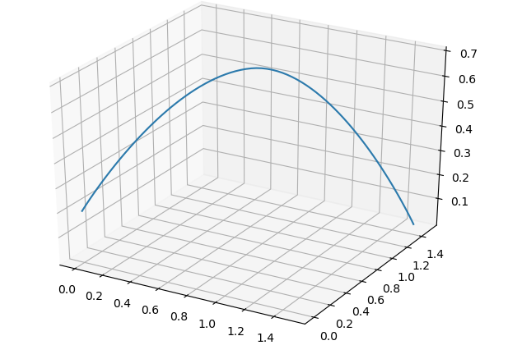

---
采用MIT-mini-cheetah的方案，使用贝塞尔曲线方程

## 贝塞尔曲线
贝塞尔曲线是由法国工程师所发表的，一开始被广泛应用在汽车的主体设计上，后来被工程师以稳定数值的方法开发出该算法。直到目前，贝塞尔曲线仍被广泛应用在轨迹规划中

先给出公式：
$$
B(t)=\sum_{i=0}^{n}\begin{pmatrix}n\\i\end{pmatrix}P_{i}(1-t)^{n-i}t^{i}
$$

## 一阶曲线
当有两个点P0,P1时，设有一个点Pt，随着时间由P0运动到P1，则这个过程可以由：  
$$B(t)=(1-t)P_{0}+tP_{1},t\in [0,1]$$

利用pytho里的绘图工具
```
import matplotlib.pyplot as plt
import numpy as np

points = np.array([[0,0],[1,1]])
t = np.linspace(0,1,1000)
t = np.array([t,t]).T
B = (1-t)*points[0]+t*points[1]
plt.plot(B[:,0],B[:,1])
plt.plot(points[:,0],points[:,1],'r.')
plt.show()

```
可以看到


## 二阶曲线
公式为：
$$
B(t)=(1-t)^{2} P_{0}+2t(1-t)P_{1}+t^{2}P_{2},t\in [0,1]
$$

同样利用python工具来看一下
```
import matplotlib.pyplot as plt
import numpy as np

points = np.array([[0,0.3],[0.5,0.5],[1,0]])

t = np.linspace(0,1,1000)
t = np.array([t,t]).T

B = (1-t)*(1-t)*points[0]+2*t*(1-t)*points[1]+t*t*points[2]

plt.plot(B[:,0],B[:,1])
plt.plot(points[:,0],points[:,1])
plt.plot(points[:,0],points[:,1],'r.')
plt.show()

```

得到二阶贝塞尔曲线图像


同理可以一直画出更高阶的贝塞尔曲线

## mini-cheetah中的贝塞尔轨迹
由于四足机器人足端在空间中运行，因此对于points是三维的，也就是我们规定这样来定义足端的位置p0[x0,y0,z0]

首先来看一下cheetah的源码中是如何做的：
```
template <typename T>
void FootSwingTrajectory<T>::computeSwingTrajectoryBezier(T phase, T swingTime)
{
  _p = Interpolate::cubicBezier<Vec3<T>>(_p0, _pf, phase);
  _v = Interpolate::cubicBezierFirstDerivative<Vec3<T>>(_p0, _pf, phase) / swingTime;
  _a = Interpolate::cubicBezierSecondDerivative<Vec3<T>>(_p0, _pf, phase) / (swingTime * swingTime);

  T zp, zv, za;

  if (phase < T(0.5))
  {
    zp = Interpolate::cubicBezier<T>(_p0[2], _p0[2] + _height, phase * 2);
    zv = Interpolate::cubicBezierFirstDerivative<T>(_p0[2], _p0[2] + _height, phase * 2) * 2 / swingTime;
    za = Interpolate::cubicBezierSecondDerivative<T>(_p0[2], _p0[2] + _height, phase * 2) * 4 / (swingTime * swingTime);
  }
  else
  {
    zp = Interpolate::cubicBezier<T>(_p0[2] + _height, _pf[2], phase * 2 - 1);
    zv = Interpolate::cubicBezierFirstDerivative<T>(_p0[2] + _height, _pf[2], phase * 2 - 1) * 2 / swingTime;
    za = Interpolate::cubicBezierSecondDerivative<T>(_p0[2] + _height, _pf[2], phase * 2 - 1) * 4 / (swingTime * swingTime);
  }

  _p[2] = zp;
  _v[2] = zv;
  _a[2] = za;
}
```

在cheetah中，使用了一个插值运算库Interpolation，用来求解贝塞尔曲线。首先定义了起始点p0与终点pf以及抬腿高度height,调用库里的cubicBezier函数计算，cubicBezier函数实现为：
```
  template <typename y_t, typename x_t>
  y_t cubicBezier(y_t y0, y_t yf, x_t x)
  {
    static_assert(std::is_floating_point<x_t>::value,
                  "must use floating point value");
    assert(x >= 0 && x <= 1);
    y_t yDiff = yf - y0;
    x_t bezier = x * x * x + x_t(3) * (x * x * (x_t(1) - x));
    return y0 + bezier * yDiff;
  }
```
也就是
$$
\triangle P = P_{f}-P_{0} 
\\b = t^{3}+3t^{2}(1-t)
\\P_{out} = P_{0}+b\triangle P
$$

在三维空间中，也就是
$$
\begin{bmatrix}x_{out}\\y_{out}\\z_{out}\end{bmatrix} = \begin{bmatrix}x_{0}\\y_{0}\\z_{0}\end{bmatrix} + (t^{3}+3t^{2}(1-t)) \begin{bmatrix}x_{f}-x_{0}\\y_{f}-y_{0}\\z_{f}-z_{0}\end{bmatrix}
$$

同时将整个摆动过程分成两段：上升和下降，分别引入抬腿高度进行z的计算，再最后覆盖到相应的位置，最终计算完成_p,_v,_a，分别表示位置、速度、加速度

