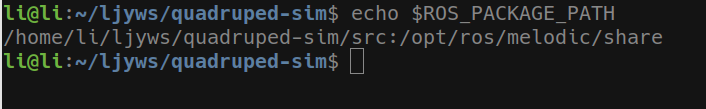
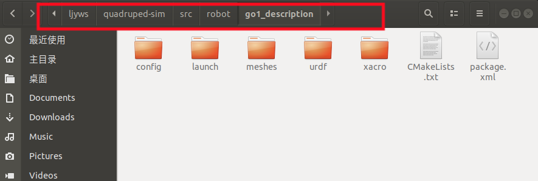
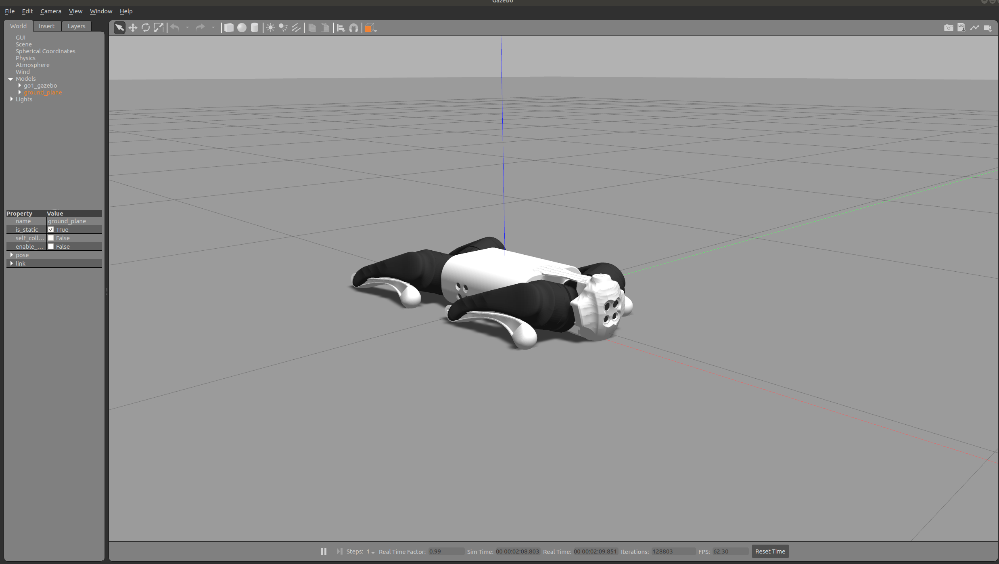
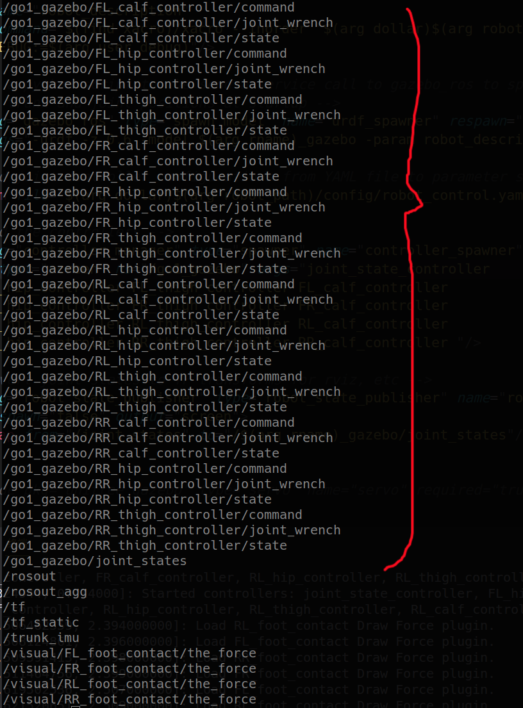

---
该项目基于ROS（melodic）框架对宇树Go1机器人进行仿真，对ros环境的配置不再赘述

## 创建ROS工作空间
```
mkdir -p quadruped-sim/src
cd quadruped-sim/src  
catkin_init_workspace 
cd ..
catkin_make
```
为了方便后续不用一直刷新环境，直接将setup.bash写入.bashrc文件里，运行如下
```
sudo gedit ~/.bashrc
source /home/li/ljyws/quadruped-sim/devel/setup.bash //在最后一行加入该行，注意自己的文件路径
source ~/.bashrc
```
使用下面一行验证是否添加成功
```
echo $ROS_PACKAGE_PATH
```
可以看到这里已经出现了我的工作空间，说明添加成功


## 下载模型
* 使用宇树的Go1模型，可以从[unitree@github](https://github.com/unitreerobotics/unitree_ros)下载unitree_ros文件，将其中的robots目录复制到我们自己的工作空间下的src里，若考虑后续其他模型的复用可全部复制，这里我仅以go1模型作为仿真对象，因此将robot下其余机器人的模型包全部删去。如下图：


* 将unitree-ros目录下的unitree_gazebo以及也复制到我们的工作空间

* 在[unitree@github](https://github.com/unitreerobotics/unitree_ros_to_real)下载unitree_ros_to_real，将里面的unitree_legged_msgs也放到我们的工作空间

#### 后续我的文件夹中将unitree前缀的文件夹大多替换为go1为前缀，方便区分
## 编译
为了简化加载，也就是不再填充某些参数，在go1_gazebo包(也就是之前的unitree_gazebo包)中的normal.launch中删除了一些多余的，launch文件如下：
```
    <arg name="rname" default="go1"/>
    <arg name="robot_path" value="(find $(arg rname)_description)"/>
    <arg name="dollar" value="$"/>

    <arg name="paused" default="true"/>
    <arg name="use_sim_time" default="true"/>
    <arg name="gui" default="true"/>
    <arg name="headless" default="false"/>
    <arg name="debug" default="false"/>
    <!-- Debug mode will hung up the robot, use "true" or "false" to switch it. -->
    <arg name="user_debug" default="false"/>
    
    <include file="$(find gazebo_ros)/launch/empty_world.launch">
        <arg name="debug" value="$(arg debug)"/>
        <arg name="gui" value="$(arg gui)"/>
        <arg name="paused" value="$(arg paused)"/>
        <arg name="use_sim_time" value="$(arg use_sim_time)"/>
        <arg name="headless" value="$(arg headless)"/>
    </include>

    <!-- Load the URDF into the ROS Parameter Server -->
    <param name="robot_description"
           command="$(find xacro)/xacro --inorder '$(arg dollar)$(arg robot_path)/xacro/robot.xacro' 
           DEBUG:=$(arg user_debug)"/>

    <!-- Run a python script to the send a service call to gazebo_ros to spawn a URDF robot -->
    <!-- Set trunk and joint positions at startup -->
    <node pkg="gazebo_ros" type="spawn_model" name="urdf_spawner" respawn="false" output="screen"
          args="-urdf -z 0.6 -model $(arg rname)_gazebo -param robot_description -unpause"/>


```

使用catkin_make编译

## 运行
```
roslaunch go1_gazebo normal.launch
```

成功加载go1模型


## 加载控制器
直接使用宇树提供的控制器接口，即unitree_controller

首先复制unitree_legged_crntrol包到工作空间

修改normal.launch文件如下：
```
<launch>
    <arg name="rname" default="go1"/>
    <arg name="robot_path" value="(find $(arg rname)_description)"/>
    <arg name="dollar" value="$"/>

    <arg name="paused" default="true"/>
    <arg name="use_sim_time" default="true"/>
    <arg name="gui" default="true"/>
    <arg name="headless" default="false"/>
    <arg name="debug" default="false"/>
    <!-- Debug mode will hung up the robot, use "true" or "false" to switch it. -->
    <arg name="user_debug" default="false"/>
    
    <include file="$(find gazebo_ros)/launch/empty_world.launch">
        <arg name="debug" value="$(arg debug)"/>
        <arg name="gui" value="$(arg gui)"/>
        <arg name="paused" value="$(arg paused)"/>
        <arg name="use_sim_time" value="$(arg use_sim_time)"/>
        <arg name="headless" value="$(arg headless)"/>
    </include>

    <!-- Load the URDF into the ROS Parameter Server -->
    <param name="robot_description"
           command="$(find xacro)/xacro --inorder '$(arg dollar)$(arg robot_path)/xacro/robot.xacro' 
           DEBUG:=$(arg user_debug)"/>

    <!-- Run a python script to the send a service call to gazebo_ros to spawn a URDF robot -->
    <!-- Set trunk and joint positions at startup -->
    <node pkg="gazebo_ros" type="spawn_model" name="urdf_spawner" respawn="false" output="screen"
          args="-urdf -z 0.6 -model $(arg rname)_gazebo -param robot_description -unpause"/>

    <!-- Load joint controller configurations from YAML file to parameter server -->
    <rosparam file="$(arg dollar)$(arg robot_path)/config/robot_control.yaml" command="load"/>

    <!-- load the controllers -->
    <node pkg="controller_manager" type="spawner" name="controller_spawner" respawn="false"
          output="screen" ns="/$go1_gazebo" args="joint_state_controller
          FL_hip_controller FL_thigh_controller FL_calf_controller
          FR_hip_controller FR_thigh_controller FR_calf_controller
          RL_hip_controller RL_thigh_controller RL_calf_controller
          RR_hip_controller RR_thigh_controller RR_calf_controller "/>

    <!-- convert joint states to TF transforms for rviz, etc -->
    <node pkg="robot_state_publisher" type="robot_state_publisher" name="robot_state_publisher"
          respawn="false" output="screen">
        <remap from="/joint_states" to="/$(arg rname)_gazebo/joint_states"/>
    </node>

    <!-- <node pkg="unitree_gazebo" type="servo" name="servo" required="true" output="screen"/> -->


</launch>
```

重新运行后
```
rostopic list 
```
可以看到和各个关节的控制器都已经加载了进来


